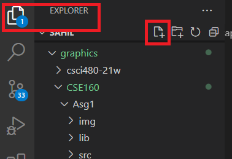

# Preparation
1. Install vscode

1. Then click on the extension icon on the left

   

1. Then add Markdown All in One

   

1. Then open a folder/workspace - this is what code uses as a working directory

1. On the explorer you can add a file

   

   Just add a file with a .md extension

1. Or open the file in this folder

1. Then you can click on the little icon on the tab

   

1. Then you will get the rendering preview in real-time

1. to get more examples you can click on the extension information

   

# latex variables
$x$ is a variable

# section 1
section 1

# section 2
section 2

# links

[To section 1](#section-1)

[To section 2](#section-2)